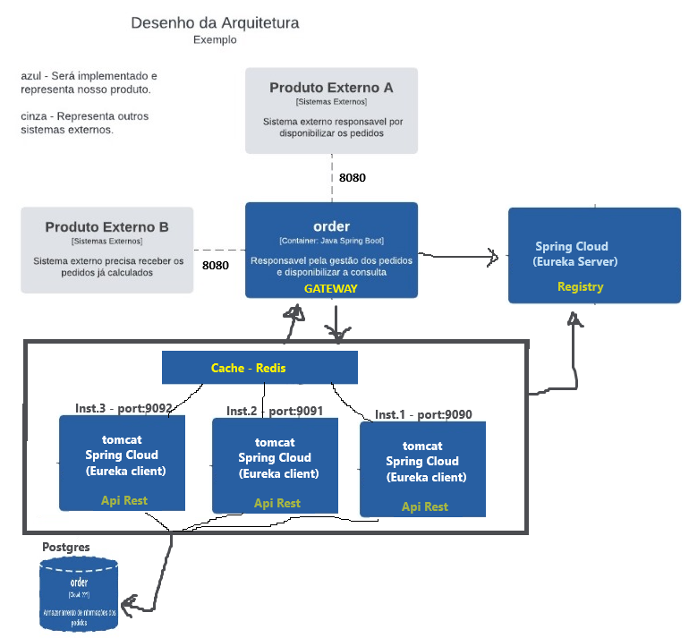

# gerenciador-de-pedidos
Sistema para gerenciar os pedidos vindos de serviços externos e consultas tambem de serviços externos.

### Prerequisitos

* Java 1.8
* Mavem
* PostgreSQL

### Instalação

1. Clone the repo
   ```sh
   git clone https://github.com/edivaldo100/gerenciador-de-pedidos.git
   ```
2. Acessar pasta
   ```sh
   cd gerenciador-de-pedidos
   ```
3. Start Registry - Eurika-server
```sh
	cd /registry
	mvn spring-boot:run
```
4. Start Gateway - Eureka-client
```sh
	cd /gateway
	mvn spring-boot:run
```
4. Start RestApi - Eureka-client (Instancia 1 - 9090 porta default)
```sh
	cd /restapi
	mvn spring-boot:run
```
4. Start RestApi - Eureka-client (Instancia 2 - 9091)
```sh
	cd /restapi
	mvn spring-boot:run -Dserver.port=9091
```

### Detalhes

Eurika-server http://localhost:8761/

isAlive chamando o Gateway: http://localhost:8080/

Gravando um pedido
ex: com curl
   ```sh
    curl --location 'http://localhost:8080' \
--header 'Content-Type: application/json' \
--data '{
	"products":[
		{
			"name": "melão",
			"price": 50
		}
	]
}'
   ```
   
Consultando um pedido
ex: com curl
   ```sh
    curl --location 'http://localhost:8080/1' \
--header 'Content-Type: application/json' 
'
   ```
### Arquitetura proposta   
